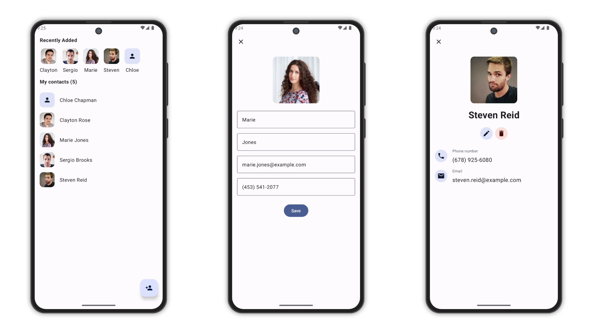

# MVI Compose Multiplatform Contacts List App With Photos (iOS & Android)

A Compose Multiplatform based version of the Contacts application. Allows the user to create and
view contacts. We'll make use of Material3 and dynamic colors, so we can stick to Google's design
guidelines.

### Status: 🚧 In progress 🚧

Contacts is still in the early stages of development, and as such only some functionalities has been
created so far.

## Screenshots

<picture>
  <source media="(prefers-color-scheme: dark)" srcset="screenshots/screenshot-dark.png">
  <source media="(prefers-color-scheme: light)" srcset="screenshots/screenshot.png">
  
</picture>

## Getting Started

To run the app locally, follow these steps:

1. Clone the repository to your local machine.
2. Open the project in Android Studio.
3. Build and run the app on an Android emulator or a physical device.

## Contributing

Contributions are welcome! If you'd like to contribute to this project, please fork the repository,
create a branch, make your changes, and submit a pull request.

## License

```
Copyright 2020 The Android Open Source Project

Licensed under the Apache License, Version 2.0 (the "License");
you may not use this file except in compliance with the License.
You may obtain a copy of the License at

    https://www.apache.org/licenses/LICENSE-2.0

Unless required by applicable law or agreed to in writing, software
distributed under the License is distributed on an "AS IS" BASIS,
WITHOUT WARRANTIES OR CONDITIONS OF ANY KIND, either express or implied.
See the License for the specific language governing permissions and
limitations under the License.
```

Feel free to explore the code and use this project as a reference for your own Android development
endeavors. If you have any questions or need assistance, please don't hesitate to reach out.

Happy learning!